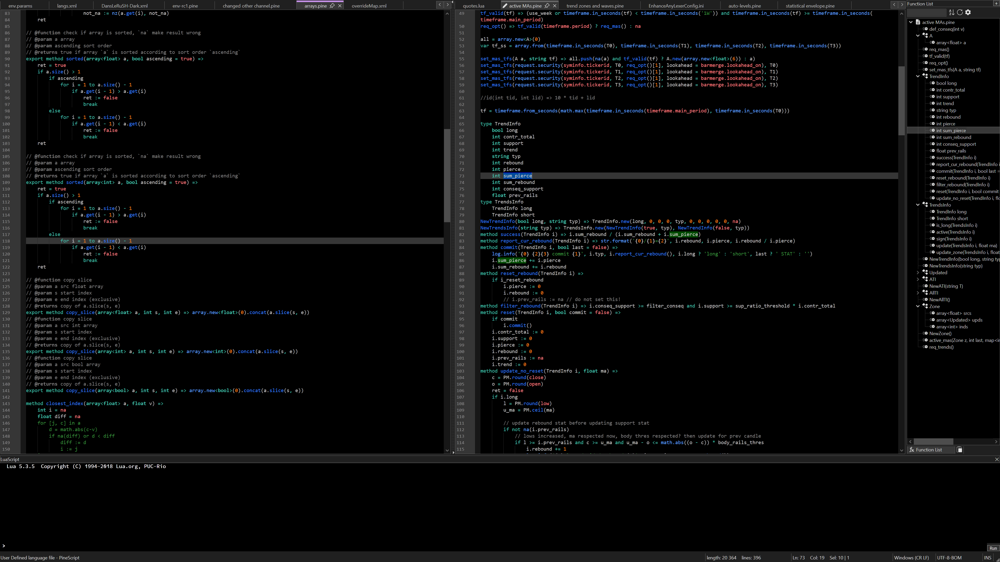
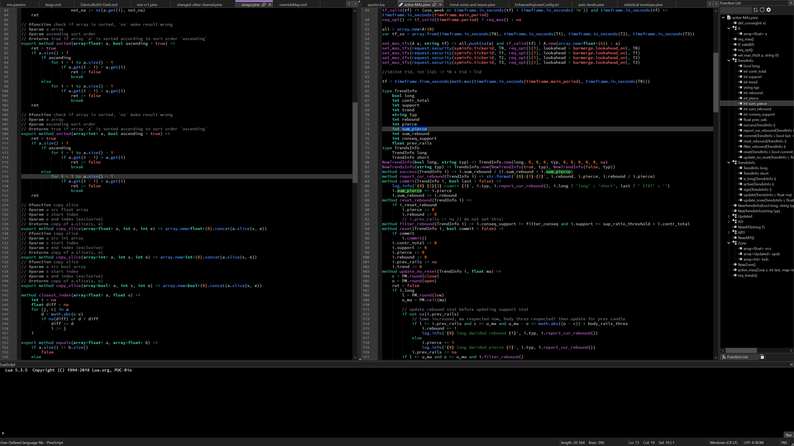

# PineScipt UDL
PineScript integration with Notepad++ (NPP). Supports PineScript v6 as of January 2026. Provides autocompletion, function list and syntax highlighting for `*.pine` files

# Why would anyone need this?
1. Pine Editor doesn't provide function list yet
1. Pine Editor doesn't allow changing fonts or syntax colors

Included `userDefineLangs\PineScript.xml` and `EnhanceAnyLexerConfig.ini` together define a color scheme as close to current color scheme of Pine Editor as is possible in NPP. You can change the colors to suit your needs better. For example, `EnhanceAnyLexerConfig-user-violet.ini` changes all user-defined functions to be colored the same way Pine Editor colors imported functions.

Also Dark Mode users (on Windows) might not know that Pine Editor uses Bold for types because it also uses Consolas font which has very thin Bold. Changing a font will make (standard) types stand out more.

Default looks with included theme

Alternate enhancer config and a different font

# Installation
## If your NPP install is global
1. Download this repo as zip and unpack somewhere
1. Copy `userDefineLangs\PineScript.xml` to `%AppData%\Notepad++\userDefineLangs\`
1. Copy `autoCompletion\PineScript.xml` to `c:\Program Files\Notepad++\autoCompletion\PineScript.xml` or wherever you installed NPP
1. Copy `functionList\PineScript.xml` to `%AppData%\Notepad++\functionList\`
1. Add string `<association id= "PineScript.xml"	    userDefinedLangName="PineScript"/>` to `c:\Program Files\Notepad++\functionList\overrideMap.xml` after the `<!-- ==================== User Defined Languages ============================ -->` string

Steps 3 and 5 will need elevation.

After this optionally do any of these:
* Highly recommended: install `EnhanceAnyLexer` plugin through NPP-Plugins-Plugins Admin... and create `%AppData%\Notepad++\plugins\config\EnhanceAnyLexer\EnhanceAnyLexerConfig.ini` using one of `plugins\config\EnhanceAnyLexer\EnhanceAnyLexerConfig*.ini`. This would greatly improve highlighting:
    1. Highlights standard library method calls
    1. Highlights unknown parameter names in red
    1. Highlights colors as constants (otherwise - as numbers)
    1. Highlights imports
    1. Rehighlights functions with names colliding with variable and type names (otherwise functions like `int` would be colored as types)
* Copy `themes\DansLeRuSH-Dark.xml` to `%AppData%\Notepad++\themes\`. It is a changed version of the theme shipped with NPP. Selection is more legible, background is set to 0 (as in Dark Mode of Pine Editor), font is set to Consolas (as in Pine Editor on Windows)

After all of this restart Notepad++ and optionally select a theme via NPP-Settings-Style Configurator... Default NPP (light) theme should work, as well as provided `DansLeRuSH-Dark.xml` theme and themes like `vim Dark Blue`, `Hello Kitty` and `Zenburn`

## If your NPP install is portative
I believe you can just unpack the folders from the downloaded repo zip into the installation folder, thus merging the folder structure. If not, please consult NPP help.

# Known gotchas
1. My UDL supports coloring of `str.format` placeholders. This can malfunction if you construct format strings from other strings. Also if you type `{` by mistake anywhere in the code the effects would be unexpected and probably funny. If this additional feature gets in your way, disable it buy going to NPP-Language-User Defined Language-Define Your Language-PineScript-Operators & Delimiters and removing `{` and `}` from `Delimiter 3`
1. Comments ending in `, ` may trigger erroneous coloring of the left hand side of the following assignment
1. `@version=` isn't bolded like other directives because of UDL limitations.
